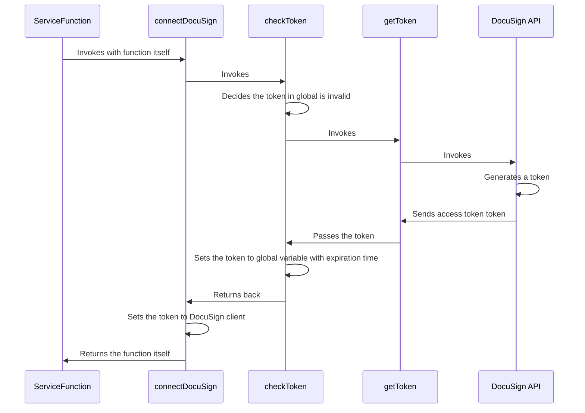

# piller

This API was created for a hackathon which lasted 15 hours

```mermaid
sequenceDiagram
ServiceFunction ->> connectDocuSign: Invokes with function itself
connectDocuSign ->> checkToken: Invokes
checkToken ->> checkToken: Decides the token in global is invalid
checkToken ->> getToken: Invokes
getToken ->> DocuSign API: Invokes
DocuSign API ->> DocuSign API: Generates a token
DocuSign API ->> getToken: Sends access token token
getToken ->> checkToken: Passes the token
checkToken ->> checkToken: Sets the token to global variable with expiration time
checkToken ->> connectDocuSign: Returns back
connectDocuSign ->> connectDocuSign: Sets the token to DocuSign client
connectDocuSign ->> ServiceFunction: Returns the function itself
```
